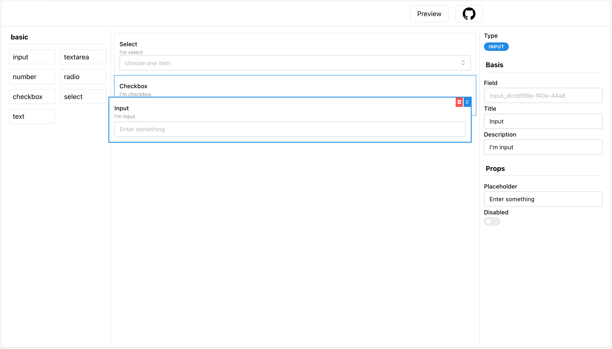

a simple low code engine

## install

```
npm i @l-lib/low-code-engine
```

## how to use

```jsx
import React, { useState } from 'react';

const View = ({ configValue }) => {
  return <div>{configValue.value || 'text'}</div>;
};

const Config = ({ configValue, onUpdate }) => {
  return (
    <input
      type="text"
      value={configValue.value || 'text'}
      onChange={(e) => {
        onUpdate({ value: e.target.value });
      }}
    />
  );
};

export const textCompInfo = {
  type: 'text',
  name: 'text',
  group: 'basic',
  view: View,
  config: Config,
};


function Sample() {
  const [schema, setSchema] = useState();
  return (
    <Playground schema={schema} setSchema={setSchema} list={[textCompInfo]} />
  );
}
```
