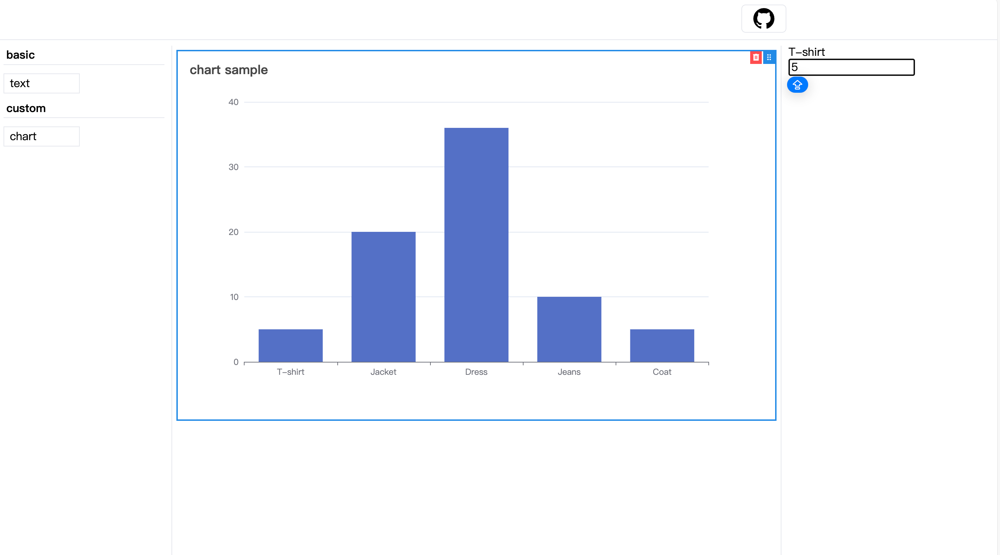

a simple, intuitive, extensible low-code core components

demo:
AI low code platform [link](https://github.com/louis61619/form-generator)

## install

```
npm i @l-lib/low-code-engine
```

## how to use

```jsx
import React, { useState } from 'react';
import { Playground } from '@l-lib/low-code-engine';

const View = ({ configValue }) => {
  return <div>{configValue.value || 'text'}</div>;
};

const Config = ({ configValue, onUpdate }) => {
  return (
    <input
      type="text"
      value={configValue.value || 'text'}
      onChange={(e) => {
        onUpdate({ value: e.target.value });
      }}
    />
  );
};

export const textCompInfo = {
  type: 'text',
  name: 'text',
  group: 'basic',
  view: View,
  config: Config,
};


function Sample() {
  const [schema, setSchema] = useState();
  return (
    <Playground schema={schema} setSchema={setSchema} list={[textCompInfo]} />
  );
}
```
use Typescript

```tsx
import { useState } from 'react';
import { Playground, Schema } from '@l-lib/low-code-engine';
import { CompInfoType, ConfigCompProps, ViewCompProps } from '@l-lib/low-code-engine';

type ConfigType = {
  value: string;
};

const View: ViewCompProps<ConfigType> = ({ configValue }) => {
  return <div>{configValue.value || 'text'}</div>;
};

const Config: ConfigCompProps<ConfigType> = ({ configValue, onUpdate }) => {
  return (
    <input
      type="text"
      value={configValue.value || 'text'}
      onChange={(e) => {
        onUpdate({ value: e.target.value });
      }}
    />
  );
};

export const textCompInfo: CompInfoType<ConfigType> = {
  type: 'text',
  name: 'text',
  group: 'basic',
  view: View,
  config: Config,
};


function Sample() {
  const [schema, setSchema] = useState<Schema>();
  return <Playground schema={schema} setSchema={setSchema} list={[textCompInfo, chartCompInfo]} />;
}
```
